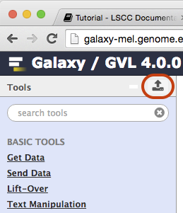
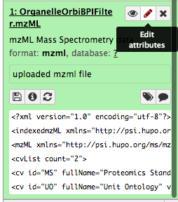
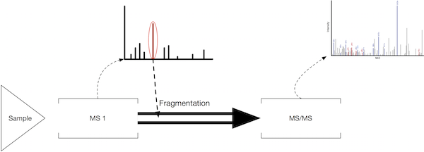

Identifying proteins from mass spec data
==========================================

Overview
--------

This tutorial describes how to identify a list of proteins from tandem mass spectrometry data. 

Analyses of this type are a fundamental part of most proteomics studies. The basic idea is to match tandem ms spectra obtained from a sample with equivalent theoretical spectra from a reference protein database. The process is referred to as "protein database search" or even "protein sequencing", although amino acid sequences are not obtained _de novo_ with this method.

The data used in this tutorial were obtained from a single run on an Orbitrap Elite mass spectrometer.  The sample itself corresponds to a purified organelle from Mouse cells.  

The aim of the tutorial will be to create a list of all proteins that can be confidently said to be present in the sample, and then to use this list to guess the identity of the "mystery" organelle.

This tutorial uses free software including;

- The [X!Tandem](http://www.thegpm.org/tandem/) search engine
- The [Trans Proteomic Pipeline](http://en.wikipedia.org/wiki/Trans-Proteomic_Pipeline) (TPP) for post-search validation
- The [Protk](https://github.com/iracooke/protk) tool suite for various conversion tasks and to make working with X!Tandem and the TPP easier
- The [Galaxy](http://galaxyproject.org/) platform to bring all these tools together

Login to Galaxy
---------------

1. Open a browser and go to a Galaxy server.
    * You can use a galaxy server of your own **or**
    * [Galaxy Tute](http://galaxy-tut.genome.edu.au) at genome.edu.au

    >   Use a supported browser. Firefox/Safari/Chrome all work well
    >  
    >  If you use your own galaxy server you will need to make sure you have the [protk proteomics tools](github.com/iracooke/protk-galaxytools) installed.
    

2. Register as a new user if you don’t already have an account on that particular server

Import mass spec data
---------------------

1. [Create a new history](background_galaxy#create-a-new-history) in Galaxy and name it "Organelle Tutorial"
2. **Download datasets** using the Galaxy uploader tool. 
    
    Open this tool by clicking the button as shown below
    
    
    
    After opening the tool select _Paste/Fetch data_ and paste the following URL into the box that appears.  Then click _Start_ to initiate the download.

        https://swift.rc.nectar.org.au:8888/v1/AUTH_ffb00634530a4c37a0b8b08c48068adf/proteomics_tutorial/OrganelleSample.mzML

    After the download is finished you should have a single item in your history.

3. **Rename** the history item by clicking the pencil icon beside it to "Edit attributes".

    

    This should bring up a dialog box where you can edit the name.  

    Change the name by removing everything up to the last forward slash "/"

    Your item should then be named _OrganelleSample.mzML_

    Dont forget to click "Save"

Basic properties of the data
----------------------------

**Format:**

Mass spectrometry data comes in many different formats and the first step in a proteomics analysis often involves data conversion or pre-processing. You can read more about [mass spectrometry data formats here](background_data_formats.md) 

\showable{ 1) What format is the OrganelleSample.mzML file?}{question}

\endshowable

\showable{Hint}{hint}

Try clicking the title bar on the data in your galaxy history.  This will toggle display of some additional information about the data.

\endshowable

\showable{Answer}{answer}

* mzML

\endshowable

**MS versus MS/MS:**

A key feature of _Tandem_ mass spectrometry is the acquisition of mass spectra (spectra) that measure the masses of precursor ions (whole peptides) as well as spectra that measure the fragment masses of a single selected peptide.  These two types of measurements are called **MS** and **MS/MS** spectra respectively.  The following schematic shows how an **MS/MS** scan results from the fragmentation of a selected product ion.  Often multiple **MS/MS** spectra are obtained for each **MS** scan, selecting different precursor masses each time so that as many peptides as possible can be analyzed.

**Number of spectra:**

Click the eye icon on the history item to view the _mzML_ file as text.  The file is almost impossible to read by hand but with some text searching we will be able to deduce the number of **MS** and **MS/MS** spectra in the file.

Now try searching for the text "MS1 spectrum" in the page using your web browser's search function.  Looking closely you should see that this text appears once for every **MS1** spectrum in the file (plus it occurs one extra time at the top of the file as part of the file description).  The file is large though and the browser can only see the first megabyte of it. 

Now search for the text "spectrumList count". It should bring you to a line in the file that says spectrumList count="24941".  There are a total of 24941 spectra in the entire file including both **MS** and **MS/MS** spectra.

\showable{ 2) How many **MS** spectra are there in this dataset?}{question}
\endshowable

\showable{Hint}{hint}

To answer this question you will need to use the _Select_ tool from the _Filter and Sort_ submenu to select lines matching the text "MS1 spectrum" in the whole file.  Then use the _Line/Word/Character count_ tool from the _Text Manipulation_ submenu to count the number of lines returned by running the _Select_ tool.

\showable{More|Less} &lt;- and here to show more

The text "MS1 spectrum" also appears at the top of the file as part of its description so you will need to subtract 1 from your answer

\endshowable

\endshowable

\showable{Answer}{answer}

* 3142

\endshowable

>In the previous exercise we used two galaxy tools in succession to find out the number of items in a file that matched some text. Future exercises use the same technique so you might find it useful to create a tiny workflow to automate this proceedure. [See the instructions here](background_findcountitems_workflow.md)

Prior to the development of tandem mass spectrometry, peptides and proteins were detected purely by matching **MS** peaks against the masses of whole peptides via [Peptide Mass Fingerprinting](https://en.wikipedia.org/wiki/Peptide_mass_fingerprinting).  This has largely been superceded by tandem mass spectrometry which gains much greater specificity by using the **MS/MS** spectra.  In this tutorial only the **MS/MS** spectra will be used.

\showable{ 3) How many **MS/MS** spectra are there in this dataset?}{question}
\endshowable

\showable{Hint}{hint}

Use the fact that the file contains a total of 24941 spectra with your answer to the previous question about **MS** spectra.

\endshowable

\showable{Answer}{answer}

* 21799

\endshowable

Alternate data formats
----------------------

Another format you are likely to encounter for tandem mass spectrometry data is _Mascot Generic Format_ or _mgf_.  Mascot Generic Format (_mgf_) is the data file format preferred by the _Mascot_ search engine.  It is a text based format is much easier to read by hand than the _mzML_ file.  Each spectrum appears between "BEGIN IONS" and "END IONS" statements and simply consists of (_mz_,_intensity_) pairs.  Additional summary information about the precursor (whole peptide) ion such as its mass, retention time and charge are included. 

1. Download the Organelle Sample data in _mgf_ format

    Use the _Paste/Fetch data_ tool again and paste the following URL into the box that appears.  Then click _Start_ to initiate the download.

        https://swift.rc.nectar.org.au:8888/v1/AUTH_ffb00634530a4c37a0b8b08c48068adf/proteomics_tutorial/OrganelleSample.mgf

2. Inspect the data manually by viewing it in Galaxy. Try to get a feel for the way data is organised within the file.

\showable{ 4) How many spectra are there in this dataset and what type of spectra do you think they are?}{question}
\endshowable

\showable{Hint}{hint}

Use the same technique you used for the previous exercise (or your workflow). Remember that for every spectrum there is one "BEGIN IONS" statement in the file.

\showable{More|Less} &lt;- and here to show more

Consider your answers to questions 3 and 4

\endshowable

\endshowable

\showable{Answer}{answer}

* 21799
* MS/MS

\endshowable

Obtain a Search Database
------------------------

Setting up a search database is a critical step.  For this tutorial we have created a database for you, but if you need to create a database for your own data you'll need to consider the following key issues;

- Database size
- Whether to include decoys
- What types of variants to include if any
- How to format your database identifiers

More details are provided [here](background_protein_databases.md).

1. Download a database of Mouse proteins in _fasta_ format

    Use the _Paste/Fetch data_ tool again and paste the following URL into the box that appears.  Then click _Start_ to initiate the download.

        https://swift.rc.nectar.org.au:8888/v1/AUTH_ffb00634530a4c37a0b8b08c48068adf/proteomics_tutorial/UniprotMouseD_20140716.fasta

2. Inspect the first few items in the database in Galaxy.  The file is in [Fasta](https://en.wikipedia.org/wiki/FASTA_format) format which means that each entry has a single description line that starts with a ">" followed by a unique identifier and then some general descriptive information.  The actual sequence of amino acids is given after the description line. Take note of the format of the database identifiers. They are in Uniprot format and look like this;

        sp|Q9CQV8|1433B_MOUSE

    The database also includes decoy sequences, appended at the end.  They have identifiers like this;

        decoy_rp75404

\showable{ 5) What is the ratio of decoys to non-decoys in the database?
}{question}
\endshowable

\showable{Hint}{hint}

Decoys are easiest to search for because they all start with "decoy_". The total number of database entries can be found simply expanding the fasta file in your history (by clicking on its title).

\endshowable

\showable{Answer}{answer}

* 1:1

\endshowable

Run a search using X!Tandem
---------------------------

A large number of search engines now exist for proteomics data.  This exercise uses _X!Tandem_ which is one of the fastest and most widely used. Other search engines include _OMSSA_, _MS-GF+_ and _Mascot_.

1. Select the _X!Tandem Search_ tool
2. Enter parameters as shown in the table below (leave all others at their defaults)
3. Click Execute

Parameter Name | Value
-------------- | -----
Uploaded Fasta File | `UniprotMouseD_20140716.fasta`
MSMS File | `OrganelleSample.mgf`
Variable Modifications | `Oxidation M`
Fixed Modifications | `Carbamidomethyl C`
Missed Cleavages Allowed | `2`
Enzyme | `Trypsin`
Fragment Ion Tolerance | `0.5`
Precursor Ion Tolerance | `10 ppm`

The search should run for about 5-10 minutes and will produce an output file in _X!Tandem_ xml format. A much more useful format is _pepXML_ so the next step in the analysis will be to run a tool to convert from tandem to pepXML.

1. Select the _Tandem to pepXML_ tool
2. Select the output from the previous step as input and click _Execute_

While the search is running, read some background theory on [how search engine's work](background_search_engines.md).

Convert Results to tabular format
---------------------------------

Although the _pepXML_ format is useful as input to other tools it is not designed to be read or analyzed directly. Galaxy includes a tool to convert _pepXML_ into tabular (tab separated) format, which is much easier to read.  Tabular format also has the advantage that it can be downloaded and opened using many other programs including _Excel_ and [R](http://cran.r-project.org/).

1. Select the _pepXML to Table_ tool
2. Select the _pepXML_ file produced in the previous step as input and click _Execute_

To get the most out of tabular files it is often necessary to know the column number corresponding to columns of interest.  Explore the column assignments in your tabular file by clicking on its title in your galaxy history.  This will show extra details about the item, including a handy preview where column numbers are displayed.

\showable{ 6) In what column number is the _assumed_charge_ of peptides in the _pepXML_ tabular file?
}{question}

\endshowable

\showable{Answer}{answer}

* 3

\endshowable

Sort tabular outputs
--------------------

Examine the tabular output file from the previous step.  It contains many columns, of which the most interesting are probably the raw search engine score and the name of the protein from which each peptide has been derived. Note the presence of plenty of decoy proteins among the results.  These decoys should tend to have quite poor scores compared with real hits.  The _raw score_ for _X!Tandem_ searches is an _E-value_.  To push these decoys to the bottom of the list we can sort the data by _raw score_. 

1. Select the _Sort_ data tool from the _Filter and Sort_ menu in the left pane of Galaxy
2. Choose to sort on _raw_score_.  This is column c10 
3. Select _Ascending order_ for the sort direction (small E-values are good) and click _Execute_

Browse the resulting dataset.  The top of the file should now have very few decoys.

Convert raw scores to probabilities
-----------------------------------

Raw _X!Tandem_ scores only give a rough estimate of the reliability of each peptide to spectrum match (PSM). A better estimate can be obtained by running a tool that uses global statistical properties of the search to assign a probability to each PSM of being correct.  A number of tools exist for this, and in this tutorial we use _Peptide Prophet_, which can work with a wide variety of different search engine scoring systems. It is extremely useful as it effectively converts disparate scores to the common scale of probability. The probabilities produced by _Peptide Prophet_ can be used to set a threshold for acceptance.  For example we could decide to accept only PSM's with a probability greater than 0.95. Note that this is not the same as the False Discovery Rate which is computed by taking (1-p) for all the accepted PSM's and dividing by the total number of accepted PSM's. A widely used alternative to _Peptide Prophet_ is [Percolator](http://per-colator.com/).

If you're curious about how _Peptide Prophet_ works, take a look at [this explainer](http://proteome-software.wikispaces.com/file/view/peptide_prophet_dissected.pdf), or [the original paper](http://www.proteomecenter.org/classpubs/2keller.pdf)

1. Select the _Peptide Prophet_ tool
2. Select the _X!Tandem_ output in _pepXML_ format generated earlier as input
3. Check the box that says _Use decoys to pin down the negative distribution_.
4. Convert the resulting _pepXML_ file to tabular using the _PepXML to Table_ tool

Take a look at the resulting tabular file.  Note that this time the _peptideprophet_prob_ column is populated and contains numbers between 0 and 1.

\showable{ 7) How many PSM's have a peptideprophet probability greater than or equal to 0.95}{question}

\endshowable

\showable{Hint}{hint}

Use the _Filter_ tool from the _Filter and Sort_ submenu. Also remember that Peptide Prophet probability is given in a column called _peptideprophet_prob_.  The syntax for "greater than or equal to" in the _Filter_ tool is >=.

\showable{More|Less} &lt;- and here to show more

Use this text in _match with condition_ field of the _Filter and Sort_ tool.
    
    c11>=0.95

To answer the second question use the _Select_ tool on the filtered table to select lines matching "decoy_"

\endshowable

\endshowable

\showable{Answer}{answer}

* 3808
* 21

\endshowable

\showable{ 8) What proportion of MS/MS spectra in the original data file produce a reliable (probability greater than or equal to 0.95) peptide to spectrum match (PSM)}{question}

\endshowable

\showable{Hint}{hint}

Consider your answer to question 7 relative to the total number of MS/MS spectra in the file (question 3)

\showable{More|Less} &lt;- and here to show more

To take account of decoys remember that for every decoy in the results there is likely to be another non-decoy that is incorrect.

\endshowable

\endshowable

\showable{Answer}{answer}

* 17.27%

\endshowable

 

Perform Protein Inference
-------------------------

Up to this point we have looked at peptide to spectrum matches _PSMs_.  Each of the peptides observed will have come from a protein sequence in the _fasta_ file that we used as a database, and this protein is recorded along with the _PSM_ itself in all of the result tables we've viewed so far.  Unfortunately, the process of inferring the existence of proteins based on these _PSMs_ is much more complicated than that because some peptides are found in more than one protein, and of course some proteins are supported by more than one _PSM_.

The _Protein Prophet_ tool can be used to run a proper protein inference analysis, and assigns probabilities to individual proteins, as well as groups of related proteins.

1. Select the _Protein Prophet_ tool
2. Choose the _pepXML_ formatted output from _Peptide Prophet_ as input and click _Execute_
3. Convert the resulting _protXML_ to tabular using the _protXML to Table_ tool.

\showable{ 9) How many proteins are there with protein prophet probability greater than or equal to 0.99?}{question}

\endshowable

\showable{Hint}{hint}

Filter on column 6 _protein_probability_

\endshowable

\showable{Answer}{answer}

* 601

\endshowable

If you have time, read over [these notes](background_protein_prophet.md) on the Protein Prophet output.  Explore your output (use the unfiltered tabular output) to find examples of different kinds of Protein groupings.

Functional enrichment analysis
------------------------------

This step will allow you to discover the identity of the Organelle that was used to create the sample.  

We use the GOrilla gene ontology enrichment analysis tool (a web based tool) to discover GO terms that are over-represented in proteins at the top of our list compared with those that are assigned very low probabilities (at the bottom).

1. Start with unfiltered tabular protein prophet results
2. Use the Cut columns tool from the Text Manipulation menu to extract the third column from the filtered protein table (contains _protein_name_). 
3. Convert the "pipes" that separate parts of the protein_name into separate columns using the _Convert delimiters to TAB_ tool in the _Text manipulation_ submenu of Galaxy. This should result in a file with 3 columns
4. Use the _Cut columns_ tool again to cut the second column from this dataset
5. Download this file to your desktop and rename it to _organelle.txt_
6. Open the [GOrilla](http://cbl-gorilla.cs.technion.ac.il/) web page in your web browser
7. Select _Organism_ as Mouse
8. Upload the _organelle.txt_ file as a ranged gene list
9. Choose _Component_ for the ontology
9. Submit

\showable{ 9) What **intracellular** organelle was enriched in the sample?}{question}

\endshowable

\showable{Hint}{hint}

Ignore terms relating to _exosomes_

In the resulting output look to the most enriched and most specific GO terms. 

\endshowable

\showable{Answer}{answer}

* Mitochondria

\endshowable